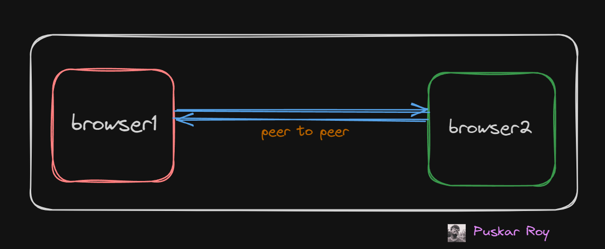
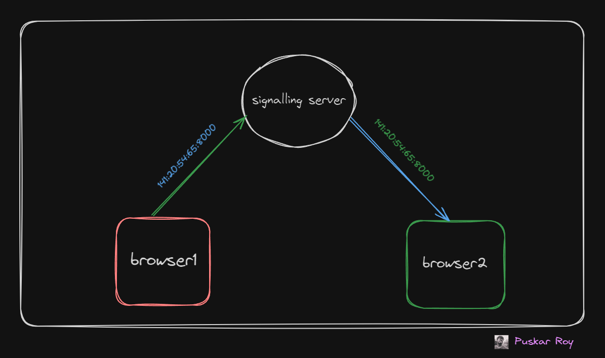
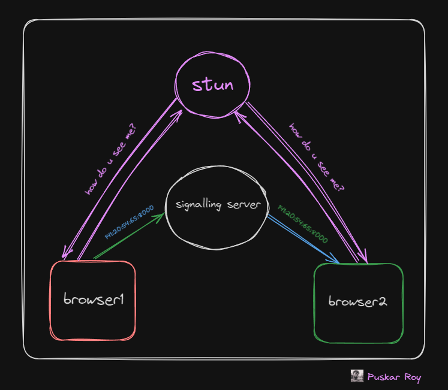
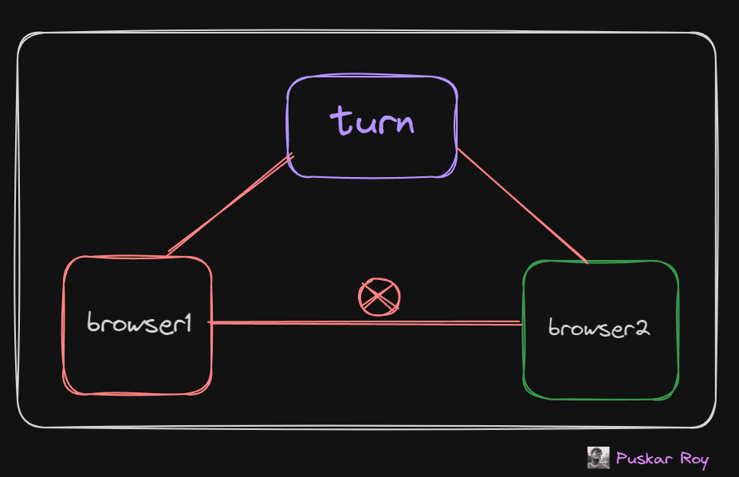

<a name="readme-top"></a>

<br />
<div align="center">
  
 
<a href="https://github.com/Puskar-Roy/Attendance-System---Backend">
    
  </a>
  
<h3 align="center">WebRTC Basic implementation 💻 </h3>
  
</div>

##### Note: _WebRTC is the core/only protocol that lets you do real time media communication from inside a browser._

## About This Project 🌟

Its a Simple one way video streaming MERN stack web application.

## Architecture of WebRTC 💻

### P2P

WebRTC is a peer to peer protocol. This means the you directly send your media over to the other person without the need of a central server



##### Note: _You do need a central server for signalling and sometimes for sending media as well_


### Signalling server

Both the browsers need to exchange their address before they can start talking to each other. A signaling server is used for that.

It is usually a websocket server but can be anything (http)





### Stun (Session Traversal Utilities for NAT)

It gives you back your publically accessable IPs. It shows you how the world sees you

You can check here

```bash
 https://webrtc.github.io/samples/src/content/peerconnection/trickle-ice/
```





### Ice candidates

ICE (Interactive Connectivity Establishment) candidates are potential networking endpoints that WebRTC uses to establish a connection between peers. Each candidate represents a possible method for two devices (peers) to communicate, usually in the context of real-time applications like video calls, voice calls, or peer-to-peer data sharing.


<!--  -->


### Turn server

A lot of times, your network doesn’t allow media to come in from browser 2 . This depends on how restrictive your network is 

Since the ice candidate is discovered by the stun server, your network might block incoming data from browser 2 and only allow it from the stun server





### Offer

The process of the first browser (the one initiating connection) sending their ice candidates to the other side.

### Answer

The other side returning their ice candidates is called the answer.

The process of the first browser (the one initiating connection) sending their ice candidates to the other side.

### SDP - Session description protocol

A single file that contains all your 
ice candidates
what media you want to send, what protocols you’ve used to encode the media

This is the file that is sent in the offer and received in the answer

Example - 
```bash
    v=0
    o=- 423904492236154649 2 IN IP4 127.0.0.1
    s=-
    t=0 0
    m=audio 49170 RTP/AVP 0
    c=IN IP4 192.168.1.101
    a=rtpmap:0 PCMU/8000
    a=ice-options:trickle
    a=candidate:1 1 UDP 2122260223 192.168.1.101 49170 typ host
    a=candidate:2 1 UDP 2122194687 10.0.1.1 49171 typ host
    a=candidate:3 1 UDP 1685987071 93.184.216.34 49172 typ srflx raddr     10.0.1.1 rport 49171
    a=candidate:4 1 UDP 41819902 10.1.1.1 3478 typ relay raddr 93.184.    216.34 rport 49172
```

### RTCPeerConnection (pc, peer connection)

This is a class that the browser provides you with which gives you access to the sdp, lets you create answers / offers , lets you send media.

This class hides all the complexity of webrtc from the developer

```bash
   https://developer.mozilla.org/en-US/docs/Web/API/RTCPeerConnection
```

## Getting Started 🚀

### Prerequisites

Before you begin contributing to this project, make sure you have the following set up:

- [Node.js](https://nodejs.org/): A JavaScript runtime.
- [npm](https://www.npmjs.com/): The Node.js package manager.


### Run This ⌨️

1. **Clone the Repository:**
   ```bash
   git clone https://github.com/Puskar-Roy/WebRTC-Basic-implementation
   ```
2. **Install Dependencies:**
   ```bash
    #frontend
    cd frontend/npm install

    #backend
    cd backend/npm install
   ```

3. **Build and Run This Project:**

   ```bash
   #for frontend
   cd frontend/npm run dev


   #for backend
   cd backend/npm run build
   cd backend/npm start
   ```


<p align="right">(<a href="#readme-top">back to top</a>)</p>

### Puskar Roy🖋️
